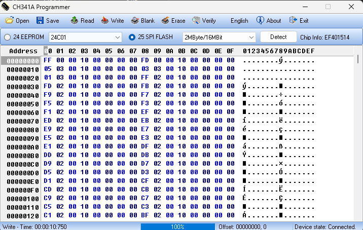
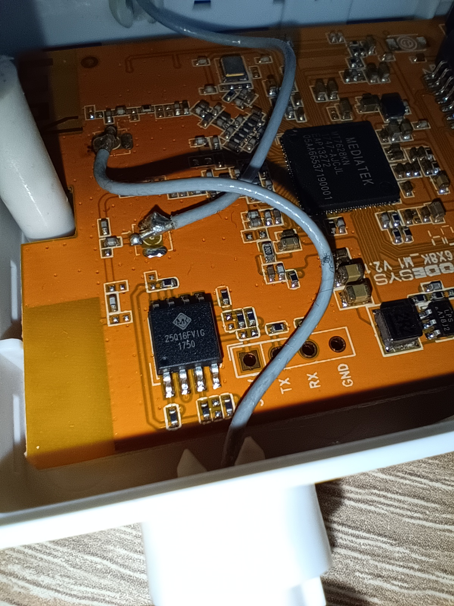
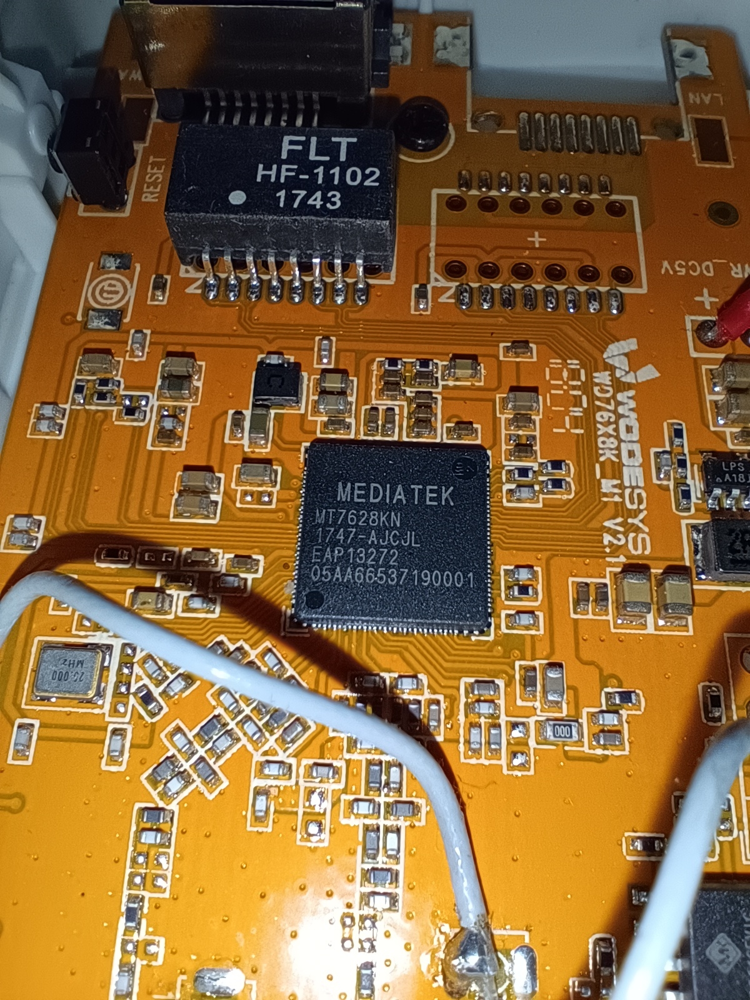
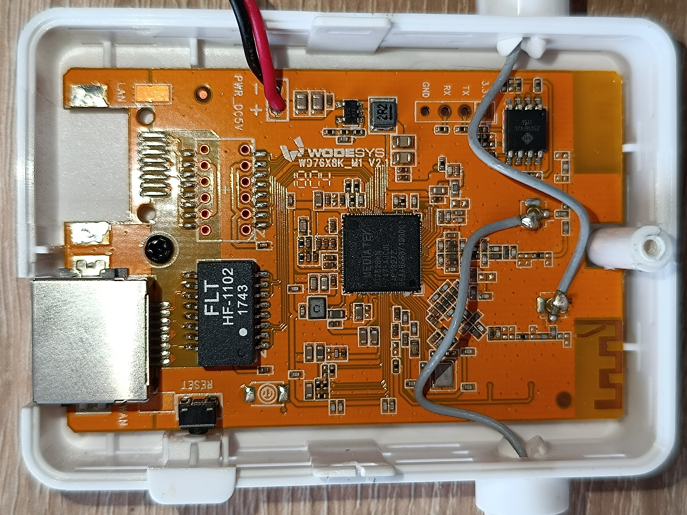
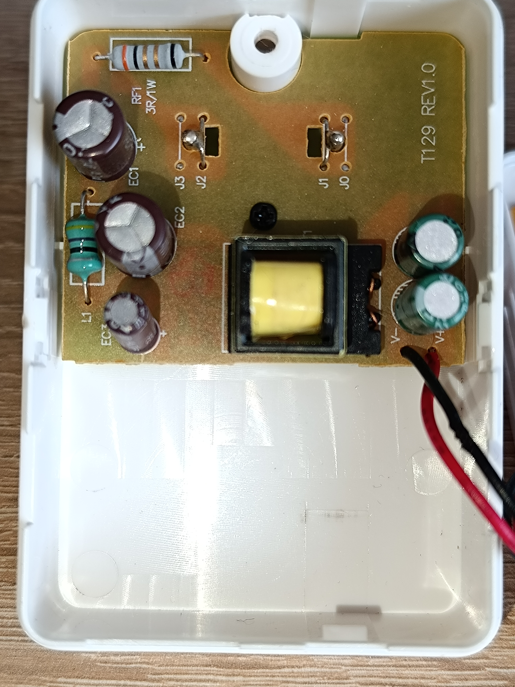

# WodeSYS WD76X8K M1 V2.1 MediaTek MTK7628KN Wi-Fi Repeater Firmware (English)

This repository contains the firmware for the WodeSYS WD76X8K M1 V2.1 MediaTek MTK7628KN Wi-Fi Repeater. The firmware was extracted using a CH341A programmer.

## Firmware Details
- Device: WodeSYS WD76X8K M1 V2.1
- Chipset: MediaTek MTK7628KN
- Firmware: Basic settings (factory default)
- Programmer: CH341A

### Files
- [Download the binary firmware](WodeSYS_WD76X8K_M1_V2.1_MediaTek_MTK7628KN_Wi-Fi_Repeater_Firmware.bin): The binary file of the firmware.
---

# WodeSYS WD76X8K M1 V2.1 MediaTek MTK7628KN Wi-Fi Repeater Firmware (Magyar)

Ez a repó a WodeSYS WD76X8K M1 V2.1 MediaTek MTK7628KN Wi-Fi repeater firmware-ét tartalmazza. A firmware-t CH341A programozóval mentettem le.

## Firmware részletek
- Eszköz: WodeSYS WD76X8K M1 V2.1
- Chipkészlet: MediaTek MTK7628KN
- Firmware: Alap beállítások (gyári állapot)
- Programozó: CH341A

### Fájlok
- [Firmware fájl letöltése](WodeSYS_WD76X8K_M1_V2.1_MediaTek_MTK7628KN_Wi-Fi_Repeater_Firmware.bin): The binary file of the firmware.
---

1. 
3. 
4. 
2. 
